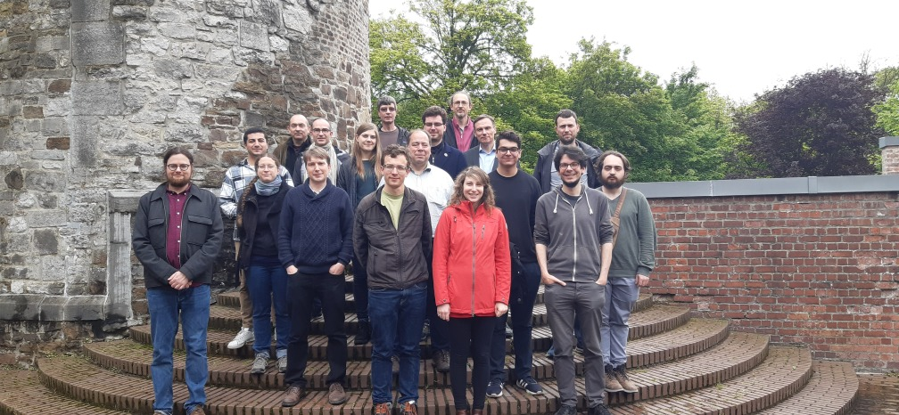

<!--img src="/_pages/WG1/Jan2023/20230129_135357_resized.jpg"/-->
< a href="20230512_125001.jpg"  </a>

< a href=""20230512_125012.jpg">  </a>

**Date:** 11-13 May 2023

**Venue:** Liège, Belgium

Thursday 11 May: A4/R30 morning, A4/S100 afternoon 

Entrance through the [Bâtiment central de l'université de Liège](https://goo.gl/maps/S72NG3nxf1YrQmcm8) downtown Liège (See below for pictures of the way, from the entrance)

Friday 12 May: Salle MIPS, Institut Montefiore, Sart Tilman (outside Liège, take bus 48)

Saturday 13 May: A4/S100 (downtown)

**Organizers:** [Alexander Steen](https://www.alexandersteen.de/)
  and [Pascal Fontaine](https://people.montefiore.uliege.be/pfontain/)
  
This is the second EuroProofNet WG2 meeting, which will take the form of a hackathon, from Thursday May 11 morning to Saturday May 13 mid-afternoon.

<!--**How to get there?**-->

<!-- **Application procedure:** The number of participants that can be reimbursed is limited. If you would like to be reimbursed of your travel, check the [eligibility rules](https://europroofnet.github.io/eligibility/) and 
[fill in this form](https://forms.gle/ZoHXRSKdbk8TxXc79). -->

**Cost:** Participants will have to pay for their travel, accommodation and meals. If you are reimbursed by EuroProofNet, note that the daily allowance has been fixed to 160 euros. See the [reimbursement rules](https://europroofnet.github.io/reimbursement-rules/) for more details.

<!--**Participants (15):**-->

**Programme:**  Working alone or in small groups on the development of tools for automated theorem proving and proofs (in particular Dedukti proofs), taking advantage of the participation of experts on Dedukti, formula and proof exchange standards, and theorem provers and solvers, and to make progress on EuroProofNet [objectives](../objectives) and [deliverables](../deliverables).  See [previous meeting](../dk-meeting3).

| --------------- | ------------------------------------------------------------------------------------ |
| Day 1           | Thursday 11 May |
| --------------- | ------------------------------------------------------------------------------------ |
| 09:00-10:00     | Get together, planning work, scheduling work sessions |
| --------------- | ------------------------------------------------------------------------------------ |
| 10:00-12:00     | Dedukti |
| --------------- | ------------------------------------------------------------------------------------ |
| 12:00-14:00     | Lunch |
| --------------- | ------------------------------------------------------------------------------------ |
| 14:00-17:00     | TPTP and proofs |
| --------------- | ------------------------------------------------------------------------------------ |
| 17:00-18:00     | Working session |
| --------------- | ------------------------------------------------------------------------------------ |
| 19:00-21:00     | Dinner |
| --------------- | ------------------------------------------------------------------------------------ |

| --------------- | ------------------------------------------------------------------------------------ |
| Day 2           | Friday 12 May |
| --------------- | ------------------------------------------------------------------------------------ |
| 09:00-11:30     | SMT and proofs |
| --------------- | ------------------------------------------------------------------------------------ |
| 11:30-12:15     | Walking to our Lunch place |
| --------------- | ------------------------------------------------------------------------------------ |
| 12:15-14:00     | Lunch |
| --------------- | ------------------------------------------------------------------------------------ |
| 14:00-14:45     | Walking back |
| --------------- | ------------------------------------------------------------------------------------ |
| 14:45-18:00     | Working session |
| --------------- | ------------------------------------------------------------------------------------ |
| 19:00-21:00     | Dinner |
| --------------- | ------------------------------------------------------------------------------------ |

| --------------- | ------------------------------------------------------------------------------------ |
| Day 2           | Saturday 13 May |
| --------------- | ------------------------------------------------------------------------------------ |
| 09:00-12:00     | Working session |
| --------------- | ------------------------------------------------------------------------------------ |
| 12:00-14:00     | Lunch |
| --------------- | ------------------------------------------------------------------------------------ |
| 14:00-17:00     | Working session |
| --------------- | ------------------------------------------------------------------------------------ |

**Accessing the rooms**

From the main entrance, Place du 20 Août:

enter the building,

take the right corridor (follow the "Inscriptions" arrows on the floor)...

...that you'll continue for quite some time, nearly to the end.

Really, do not turn to "Inscriptions", continue the corridor...

...to the stairs...

...and go down the stairs on the right...

Yes, right, this is not a trick... follow the light!

Get out of the building,

and turn left,

to this other building there:

For R30 (instruction for S100 below, skip a few pictures), go up

turn right,

continue the corridor to the end,

really to the end,

behind the door,

You got it!

For S100, go down

and you are there:

