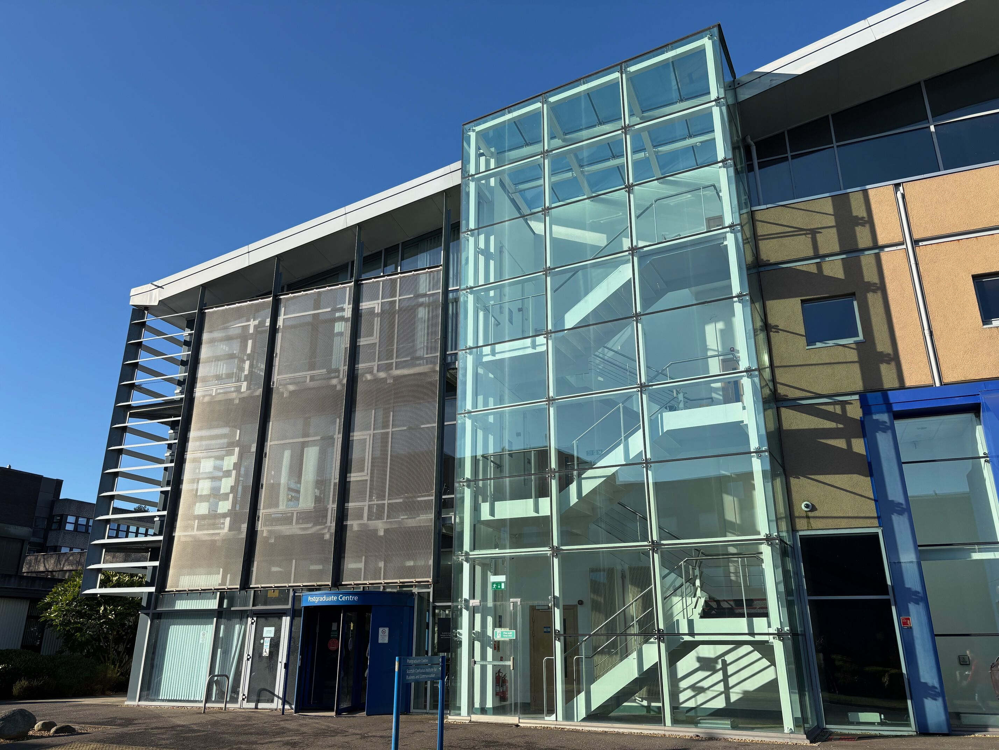
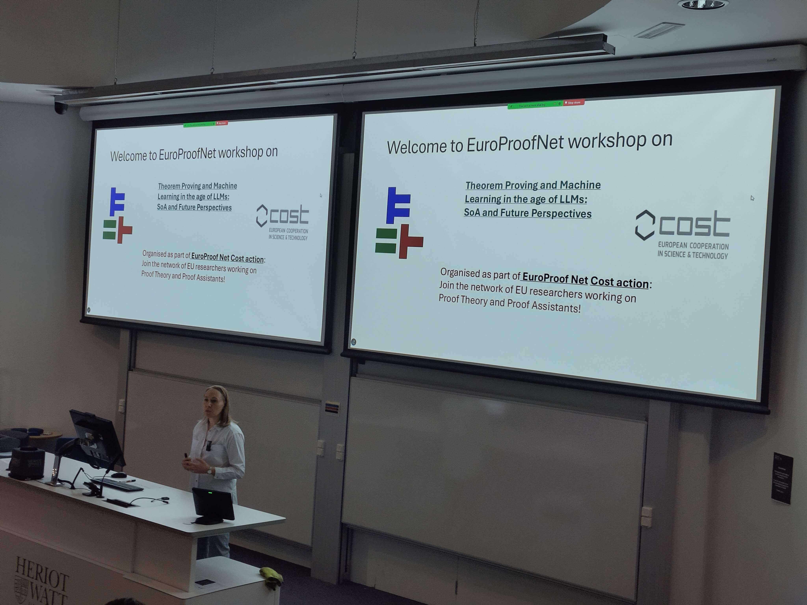
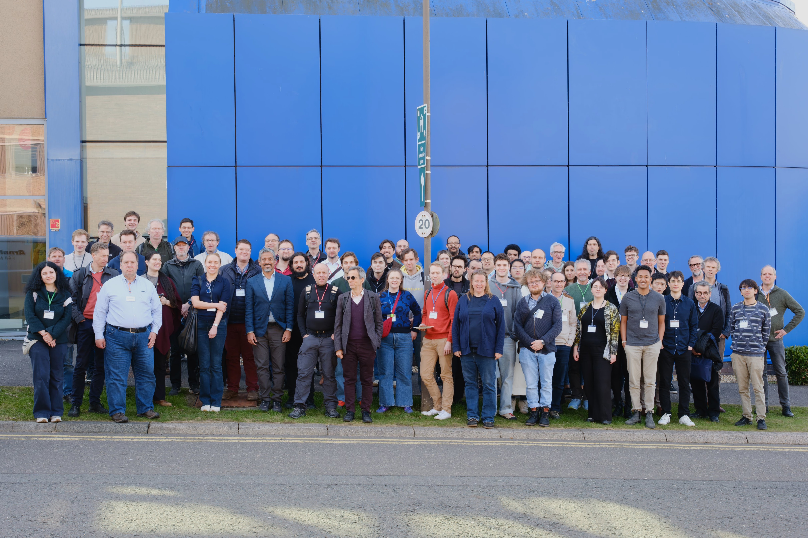
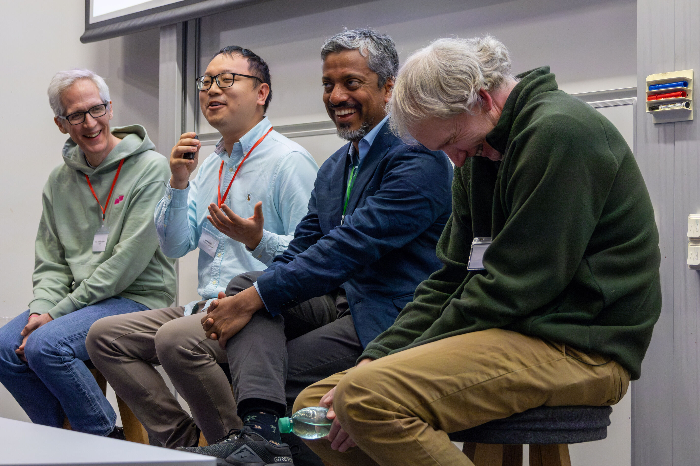
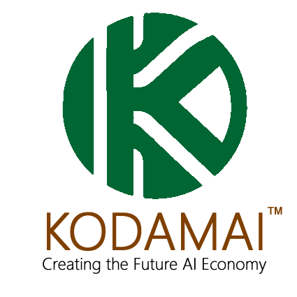

will take place in Edinburgh, Scotland, UK, April 7th-8th 2025, organised by Ekaterina Komendantskaya,  Elizabeth Polgreen, Christian Saemann, Kathrin Stark, and Michael Rawson. The event is supported by the Cost Action CA20111 - European Research Network on Formal Proofs.

*There will be no remote participation, but recordings will be uploaded where possible*.

# Aims

Machine learning (ML) has been shown to be very successful in programming and translation tasks, and creates new opportunities combining AI with proofs. Recently, various claims have been made that large language models (LLMs) will revolutionise these areas. However, many questions about the details of the applications of LLMs and their impact on theorem proving and mathematics remain open. At the workshop, we want to bring together researchers from a wide range of communities: mathematics, automated and interactive theorem proving, machine learning, natural language processing, and formal methods, in order to discuss the state-of-the-art and future directions for this new area of research.

Examples of topics that we intend to discuss include, but are not limited to:

- **ML/LLM for Advancing Proof Techniques**, e.g., tailoring LLMs to theorem-proving datasets and benchmarks, combining neural networks and symbolic reasoning for robust theorem proving, enabling LLMs to learn proof techniques from minimal data or prior examples.

- **Applications of ML/LLM in Theorem Proving**, e.g., designing co-pilot systems for theorem provers like Coq, Lean, or Isabelle, auto-formalising mathematical concepts and proofs from textbooks or research papers, human-machine collaboration workflows in proof construction.

- **Challenges and Limitations of ML/LLM in Theorem Proving**, e.g. addressing hallucinations and errors in proofs generated by LLMs, handling large and complex proof spaces with LLM-guided tools, mitigating biases introduced during LLM training on specific mathematical domains.

- **Benchmarks and Evaluation for ML/LLM in Theorem Proving**, e.g., creating datasets specifically for evaluating LLM-based theorem proving systems, assessing the interpretability and trustworthiness of LLM-generated proofs, defining success metrics for proof assistance beyond correctness, such as creativity and accessibility.

- **Interdisciplinary Impact of ML/LLM**, e.g., leveraging LLMs to teach formal methods, logic, and theorem proving to students, using LLMs to explore conjectures and new areas of mathematical research, applications in formal verification for software, hardware, and systems engineering, including industrial applications.

- **Future Directions for ML/LLM in theorem proving**: e.g.,  the implications of relying on AI systems for critical mathematical proofs, setting open standards for the integration of LLMs in the theorem-proving workflows, speculating on the evolution of LLMs and their roles in formal reasoning.

- **Cross-Domain Connections**: e.g., developing user-friendly natural language interfaces for proof assistants, adapting LLM capabilities from general domains to formal logic and proofs.

# Schedule
The workshop features 27 contributions, a panel discussion and a poster session. We are proud to have three invited speakers:
- *Formal Mathematical Reasoning: A New Frontier for Large Language Models*: [Swarat Chaudhuri](https://www.cs.utexas.edu/~swarat/) (UT Austin and Google Deepmind)
- *Machine Learning for Mathematics Research*: [Sergei Gukov](http://theory.caltech.edu/~gukov/) (Caltech & Dublin Inst. Adv. Studies)
- *Machine Learning in Theorem Proving*: [Josef Urban](https://people.ciirc.cvut.cz/~urbanjo3/) (CIIRC/CVUT)

A [detailed schedule](https://easychair.org/smart-program/EuroProofNet-WG5/) is available.
For the panel session on the 8th, we invite all participants to [propose](https://app.sli.do/event/tBCNKKKuPEphx8wp9Y3NfC) suitable questions to the panelists. We will choose 5 questions to discuss in detail.

# Registration
We are expecting a large number of participants, and therefore registration is **mandatory**. Registration is [online](https://www.epay.ed.ac.uk/conferences-and-events/college-of-science-and-engineering/school-of-informatics/informatics-events/workshop-on-theorem-proving-and-machine-learning-in-the-age-of-llms), and will close on the 12th March 2025 at 1600 UK time.

## Workshop Dinner
There is an optional workshop dinner at the [Surgeon's Hall](https://museum.rcsed.ac.uk/) at a cost of £63 per person.
You may, if you like, invite an additional guest at extra cost.
These options will be available at the time of registration.

# Location

[Postgraduate Centre Heriot-Watt](https://maps.app.goo.gl/vBKoBeCjZBNVnqeb9), Heriot-Watt University, Edinburgh, EH14 4AL, UK. More information about the campus from [Heriot-Watt](https://www.hw.ac.uk/uk/edinburgh/maps-directions.htm).

## Accommodation
- The only hotel on the HWU campus is the [Marriott Courtyard Hotel](https://www.hw.ac.uk/visit-us/visitor-accommodation).
- If booking accommodation in town, expect travel times of at least 25 minutes.

## Dinner
To get to Surgeon's Hall from Heriot-Watt University, the easiest possibility is to take the [45 or 35 bus](https://www.google.de/maps/dir/Heriot-Watt+University+Edinburgh+Campus,+Edinburgh/Surgeons'+Hall+Museums,+Surgeons+Hall+Museums,+Nicolson+St,+Edinburgh+EH8+9DW/@55.9245221,-3.293701,13z/data=!4m15!4m14!1m5!1m1!1s0x4887c46af06eff31:0xea463bd59d93b226!2m2!1d-3.320646!2d55.9095155!1m5!1m1!1s0x4887c784231b81f9:0xdd38e56f5febdafc!2m2!1d-3.1853423!2d55.946636!3e3!5i3?entry=ttu&g_ep=EgoyMDI1MDIxOS4xIKXMDSoJLDEwMjExNDU1SAFQAw%3D%3D).

## UK Electronic Travel Authorisation
The UK has introduced an Electronic Travel Authorisation system.
You may need one to enter the UK.
From 2nd April, European visitors will also need an ETA.
They can [apply](https://www.gov.uk/guidance/apply-for-an-electronic-travel-authorisation-eta) from the 5th March.

# Publication plans
The chairs are investigating the possibility of organising a special journal issue dedicated to the topics of this workshop, at the J. of Annals of Mathematics and AI. Further details will be discussed at the time of the workshop.

# Travel Grants
The travel and accommodation of a number of participants (approximately 12) will be supported by the [Cost Action CA20111 - European Research Network on Formal Proofs](https://europroofnet.github.io/).
Applications have now closed.

# Abstracts
[Steven Obua: Abstraction Logic Is All You Need](abstracts/1.pdf)  
[Alberto Gandolfi: How LLMs could Fool a Proof Checker: The Risks of Inconsistent Assumptions in Automated Proof Systems](abstracts/2.pdf)  
[Markus Pantsar: The need for ethical guidelines in mathematical research in the time of generative AI](abstracts/3.pdf)  
[Tim Fernando: Between min cost search and least action](abstracts/4.pdf)  
[Konstantinos Kogkalidis, Orestis Melkonian and Jean-Philippe Bernardy: Structure-Aware Neural Representations of Agda Programs](abstracts/5.pdf)  
[Huajian Xin: Frontier of Formal Theorem Proving with Large Language Models: Insights from the DeepSeek-Prover](abstracts/6.pdf)  
[Samuel Teuber and Bernhard Beckert: Towards LLM-support for Deductive Verification of Java Programs](abstracts/7.pdf)  
[Jonathan Julian Huerta Y Munive: DeepIsaHOL progress report: current machine learning for the Isabelle proof assistant](abstracts/8.pdf)  
[Job Petrovčič, Sebastian Mežnar and Ljupčo Todorovski: Kernel-level expression generator](abstracts/9.pdf)  
[Robin Rawiel and Lukas Niehaus: Reinforcement Learning for Term Rewrite Systems](abstracts/10.pdf)  
[Laetitia Teodorescu, Guillaume Baudart, Emilio Jesús Gallego Arias and Marc Lelarge: NLIR: Natural Language Intermediate Representation for Mechanized Theorem Proving](abstracts/11.pdf)  
[Aleksandr Shefer, Igor Engel, Stanislav Alekseev, Daniil Berezun, Ekaterina Verbitskaia and Anton Podkopaev: Are LLMs Ready for Software Verification?](abstracts/12.pdf)  
[Alexandra Fikiori, Asterios Gkantzounis, Foivos Skarpelos and Petros Stefaneas: On Abstract Logics for Interacting Provers](abstracts/13.pdf)  
[Guy Axelrod, Moa Johansson and Andrea Silvi: Intrinsic Motivation To Construct Terms In A Dependent Type Theory](abstracts/14.pdf)  
[Gleb Solovev, Nikita Khramov, Andrei Kozyrev and Anton Podkopaev: CoqPilot benchmarking framework](abstracts/15.pdf)  
[Jules Viennot, Guillaume Baudart, Emilio Jesús Gallego Arias and Marc Lelarge: MiniF2F in Rocq: Automatic Translation Between Proof Assistants — A Case Study](abstracts/16.pdf)  
[Rashid Barket, Uzma Shafiq, Matthew England and Jürgen Gerhard: Transformers to Predict the Applicability of Symbolic Integration Routines](abstracts/17.pdf)  
[Artjoms Sinkarovs: Correct by Construction Machine Learning](abstracts/18.pdf)  
[Irina Starikova: Mathematics and Creative AI](abstracts/19.pdf)  
[Luca Pasetto and Christoph Benzmüller: The Fatio Protocol for Formal Dialogue in Isabelle/HOL](abstracts/20.pdf)  
[Maxim Zyskin: Chessboard covers and AI.](abstracts/21.txt)  
[Richard Thompson, Adam Pease, Angelos Toutsios, Roberto Milanese Jr. and Jarrad Singley: Formalizing Natural Language: Cultivating LLM Translations Using Automated Theorem Proving](abstracts/22.pdf)  
[Cameron Freer, Alexander Lew, Timothy O'Donnell and Vikash Mansinghka: Autoformalization and autoinformalization via probabilistic reasoning](abstracts/23.pdf)  
[Yutaka Nagashima and Daniel Sebastian Goc: Proof By Abduction in Isabelle/HOL](abstracts/24.pdf)  
[Stephan Schulz: Automated Theorem Provers as the Hub of the AI Math Ecosystem](abstracts/25.pdf)  
[Yousef Alhessi, Sólrún Halla Einarsdóttir, Emily First, George Granberry, Moa Johansson and Nicholas Smallbone: Neuro-Symbolic Lemma Conjecturing](abstracts/26.pdf)  
[Alexei Lisitsa: In search of simplicity: a case study in ML and LLM assisted applications of ATP in mathematics](abstracts/27.pdf)  
[Bartosz Naskręcki: From Mathematical Theory to Machine Learning: Detecting Symmetry Groups in Crystallographic Tilings](abstracts/28.txt)  

# Photos

# Further Acknowledgements
We are grateful for support from the following organisations in addition to EuroProofNet.

