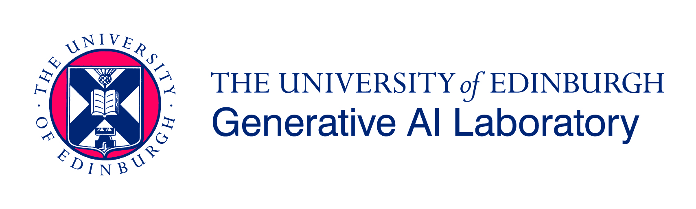

will take place in Edinburgh, Scotland, UK, April 7th-8th 2025, organised by Ekaterina Komendantskaya,  Elizabeth Polgreen, Christian Saemann, Kathrin Stark, and Michael Rawson. The event is supported by the Cost Action CA20111 - European Research Network on Formal Proofs.

# Aims

Machine learning (ML) has been shown to be very successful in programming and translation tasks, and creates new opportunities combining AI with proofs. Recently, various claims have been made that large language models (LLMs) will revolutionise these areas. However, many questions about the details of the applications of LLMs and their impact on theorem proving and mathematics remain open. At the workshop, we want to bring together researchers from a wide range of communities: mathematics, automated and interactive theorem proving, machine learning, natural language processing, and formal methods, in order to discuss the state-of-the-art and future directions for this new area of research.

Examples of topics that we intend to discuss include, but are not limited to:

- **ML/LLM for Advancing Proof Techniques**, e.g., tailoring LLMs to theorem-proving datasets and benchmarks, combining neural networks and symbolic reasoning for robust theorem proving, enabling LLMs to learn proof techniques from minimal data or prior examples.

- **Applications of ML/LLM in Theorem Proving**, e.g., designing co-pilot systems for theorem provers like Coq, Lean, or Isabelle, auto-formalising mathematical concepts and proofs from textbooks or research papers, human-machine collaboration workflows in proof construction.

- **Challenges and Limitations of ML/LLM in Theorem Proving**, e.g. addressing hallucinations and errors in proofs generated by LLMs, handling large and complex proof spaces with LLM-guided tools, mitigating biases introduced during LLM training on specific mathematical domains.

- **Benchmarks and Evaluation for ML/LLM in Theorem Proving**, e.g., creating datasets specifically for evaluating LLM-based theorem proving systems, assessing the interpretability and trustworthiness of LLM-generated proofs, defining success metrics for proof assistance beyond correctness, such as creativity and accessibility.

- **Interdisciplinary Impact of ML/LLM**, e.g., leveraging LLMs to teach formal methods, logic, and theorem proving to students, using LLMs to explore conjectures and new areas of mathematical research, applications in formal verification for software, hardware, and systems engineering, including industrial applications.

- **Future Directions for ML/LLM in theorem proving**: e.g.,  the implications of relying on AI systems for critical mathematical proofs, setting open standards for the integration of LLMs in the theorem-proving workflows, speculating on the evolution of LLMs and their roles in formal reasoning.

- **Cross-Domain Connections**: e.g., developing user-friendly natural language interfaces for proof assistants, adapting LLM capabilities from general domains to formal logic and proofs.

# Format

## Keynote Talks
- *Machine Learning in Industrial Verification*: [Swarat Chaudhuri](https://www.cs.utexas.edu/~swarat/) (UT Austin and Google Deepmind)
- *Machine Learning for Mathematics Research*: [Sergei Gukov](http://theory.caltech.edu/~gukov/) (Caltech & Dublin Inst. Adv. Studies)
- *Machine Learning in Theorem Proving*: [Josef Urban](https://people.ciirc.cvut.cz/~urbanjo3/) (CIIRC/CVUT)

## Call for Presentations
The workshop solicits contributed talks supported by an extended abstract of up to 2 pages in LNCS format, excluding references. Abstracts will be reviewed for relevance and quality and subsequently made public on the workshop's web page.
All abstracts must be submitted via [this Easychair page](https://easychair.org/conferences/?conf=europroofnetwg5).

## Publication plans
The chairs are investigating the possibility of organising a special journal issue dedicated to the topics of this workshop, at the J. of Annals of Mathematics and AI. Further details will be discussed at the time of the workshop.

**Abstract submission**: January 31st 2025 (AOE).
**Travel support application**: January 31st 2025.
**Notification of acceptance**: ASAP thereafter.

# Registration and Optional Travel Support

Please fill out the following [form](https://forms.gle/4kzSBmkDS8SMXtxXA) if you plan to attend, regardless of whether you submit an abstract or apply for support.

The travel and accommodation of a number of participants (approximately 12) will be supported by the [Cost Action CA20111 - European Research Network on Formal Proofs](https://europroofnet.github.io/).
If you want to be funded, please check the [eligibility](https://europroofnet.github.io/eligibility) and [reimbursement](https://europroofnet.github.io/reimbursement-rules/) rules to know whether you can be funded.
[Register](https://e-services.cost.eu/action/CA20111/working-groups/apply) to EuroProofNet if you have not already.

Participants who contribute talks will be given preference when applying for travel support.

# Location

[Postgraduate Centre Heriot-Watt](https://maps.app.goo.gl/vBKoBeCjZBNVnqeb9), Heriot-Watt University, Edinburgh, EH14 4AL, UK. More information about the campus:[Heriot-Watt](https://www.hw.ac.uk/uk/edinburgh/maps-directions.htm).

# Program
The [initial program](https://easychair.org/smart-program/EuroProofNet-WG5/) is online, but it is not yet fixed.
We will ask participants to finalise their registration soon.

# Further Acknowledgements
We are grateful for support from the following organisations in addition to EuroProofNet.
- [EPSRC](https://www.ukri.org/councils/epsrc/)
- [AISEC](https://www.macs.hw.ac.uk/aisec/)
- [Heriot-Watt University](https://www.hw.ac.uk/)

