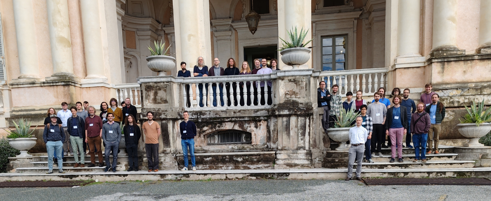
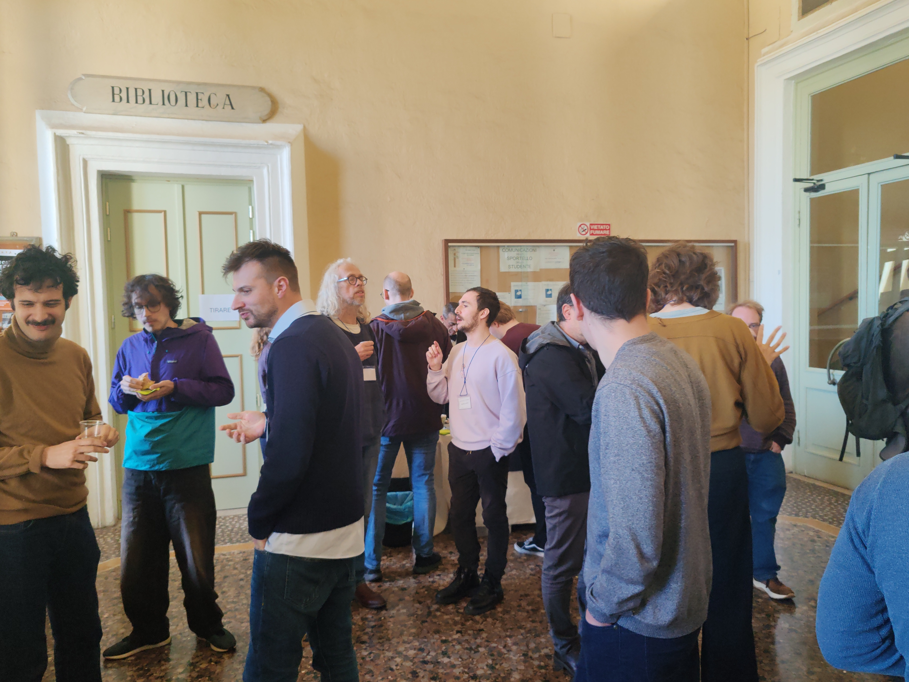

**Dates:** 17-18 April 2025

**Place:** Genova, Italy

**Venue:**  
Villa Giustiniani-Cambiaso,  
Scuola Politecnica, Università di Genova  
via Montallegro 1, Genova 16145  

<!--
⚠️⚠️ **On Thursday 17** all parks in Genoa will be closed due to strong wind. **The venue can be reached only through an entrance from viale Cambiaso**, more or less [here](https://maps.app.goo.gl/SFrJfeMmESh558zu7). You will have to enter a courtyard, reach the very end of it and turn right to a first flight of steps, then left to another flight of steps, and after those you will see the building. You will find some signs along the path. ⚠️⚠️

⚠️⚠️ Please beware of accommodation-related scam emails targeting this specific event.⚠️⚠️
-->

Co-located with the [HoTT/UF 2025 Workshop](https://hott-uf.github.io/2025/).  

The aim of this meeting series is to bring together researchers working on the topics of [Working Group 6 of EuroProofNet](https://europroofnet.github.io/wg6/). The main focus is thus on the syntax and semantics of type theory.
This includes, but is not limited to the goal of WG6:

> The aim of this WG is to develop a comprehensive theory of type theories, which (i) accounts for its domain-specific variants and the type theories currently used in proof assistants, and (ii) allows for the modular reasoning about their syntax and semantics.

The meeting will be in person with support for remote participation and is open to anyone interested in type theory. Talks can present published work or work in progress.

**Schedule and abstracts:** please see [here](programme#schedule).

**Invited speakers**

* [Francesco Gavazzo](https://sites.google.com/view/francescogavazzo/home) (Università di Padova)  
*A Mathematical Theory of Term Relations*
[[Abstract](programme#fgavazzo), [Slides](./talks/gavazzo.pdf)]
* [András Kovács](https://andraskovacs.github.io/) (Chalmers & Göteborgs universitet)  
*A generalized logical framework*
[[Abstract](programme#akovacs), [Slides](./talks/kovacs.pdf)]
* [Thomas Lamiaux](https://thomas-lamiaux.github.io/) (Nantes Université)  
*A unified Framework for Initial Semantics, and it is 2 functorial*
[[Abstract](programme#tlamiaux), [Slides](./talks/lamiaux.pdf)]
* [Paige Randall North](https://paigenorth.github.io/) (Universiteit Utrecht)  
*Comparing semantic frameworks for dependently-sorted algebraic theories*
[[Abstract](programme#prnorth), [Slides](./talks/north.pdf)]

**Contributed talks**
* Thorsten Altenkirch (University of Nottingham)  
*Containers in Higher Kinds*
[[Abstract](programme#taltenkirch), [Slides](./talks/altenkirch.pdf)]
* Mathis Bouverot-Dupuis (Ecole Normale Supérieure Paris)  
*Code Generation via Meta-programming in Dependently Typed Proof Assistants*
[[Abstract](programme#mbouverot), [Slides](./talks/bouverot-dupuis.pdf)]
* Cipriano Junior Cioffo (University of Pisa)  
*A categorical account of the setoid model*
[[Abstract](programme#ccioffo)]
* Stefania Damato (University of Nottingham)  
*Distributive Laws for Monadic Containers*
[[Abstract](programme#sdamato), [Slides](./talks/damato.pdf)]
* Michele De Pascalis (Tallinn University of Technology)  
*Monoid Structures on Indexed Containers*
[[Abstract](programme#mdepascalis), [Slides](./talks/de-pascalis.pdf)]
* Maximilian Doré (University of Oxford)  
*Linear Types with Dynamic Multiplicities in Dependent Type Theory*
[[Abstract](programme#mdore), [Slides](./talks/dore.pdf)]
* Andrea Giusto (University of Genoa)  
*Fibrations with comprehension and their completion*
[[Abstract](programme#agiusto), [Slides](./talks/giusto.pdf)]
* Andrea Laretto (Tallinn University of Technology)  
*Directed First-Order Logic*
[[Abstract](programme#alaretto), [Slides](./talks/laretto.pdf)]
* Niyousha Najmaei (Ecole Polytechnique Palaiseau)  
*Syntax for non-full comprehension categories*
[[Abstract](programme#nnajmaei), [Slides](./talks/najmaei.pdf)]
* Jacob Neumann (University of Nottingham)  
*GATs, Cats, and CwFs: A Celestial Dance*
[[Abstract](programme#jneumann), [Slides](./talks/neumann.pdf)]
* Samuel Novotný (Technical University of Košice)  
*Towards Resolving Type Inconsistencies in Transparent Intensional Logic*
[[Abstract](programme#snovotny), [Slides](./talks/novotny.pdf)]
* Lorenzo Perticone (Chalmers University of Technology)  
*Parametric Distributive Laws: uniform monad composition*
[[Abstract](programme#lperticone), [Slides](./talks/perticone.pdf)]
* Iosif Petrakis (University of Verona)  
*Categories with dependent and codependent arrows*
[[Abstract](programme#ipetrakis), [Slides](./talks/petrakis.pdf)]
* Daniel Ranalter (University of Innsbruck)  
*Erasure-Respecting Semantics for DHOL*
[[Abstract](programme#dranalter), [Slides](./talks/ranalter.pdf)]
* Pietro Sabelli (Czech Academy of Sciences)  
*On the conservativity of type theories with classical logic over arithmetic*
[[Abstract](programme#psabelli), [Slides](./talks/sabelli.pdf)]
* Matteo Spadetto (Università degli Studi di Udine)  
*A 2-categorical approach to the sematics of axiomatic dependent type theory*
[[Abstract](programme#mspadetto), [Slides](./talks/spadetto.pdf)]
* Théo Winterhalter (INRIA Saclay)  
*Local abstraction over computation in type theory*
[[Abstract](programme#twinterhalter), [Slides](./talks/winterhalter.pdf)]

**Deadlines (AoE)**

* Submission of talk proposals: Friday 28 February
* Author notification: Tuesday 4 March
* Funding request: Friday 7 March
* Registration: Friday 28 March

**Submission of talk proposals**: closed.
<!--Please fill out [this form](https://docs.google.com/forms/d/e/1FAIpQLSe7yLhQDEdegdPDhP0IRlW2p-3KjvP3lT3CbvaEGgbfu9rVCw/viewform?usp=preview) to submit a proposal for a contributed talk.-->

**Registration:**
To register, please fill out [this form](https://docs.google.com/forms/d/e/1FAIpQLSdaGDgt4Znuzn4mz6mZjoVMQnLgK-2HtbuZX6WupfpxwtRqZg/viewform?usp=preview).
<!--& funding The form also gives the option to submit a funding request.
Funding consists of reimbursement of travel expenses and a daily allowance for the meeting's dates (but recepits of both travel and accommodation expenses have to be provided).
The daily allowance has been fixed to 140 euros.
We recommend those interested in applying to read the official information regarding reimbursement available [here](../reimbursement-rules).
In particular, note that to receive funding you will be asked to register as a member of EuroProofNet if you are not already.-->

**Participants:** Please see [here](participants).

**Local information:** Please see [here](local-info).

**Organizers:** [Francesco Dagnino](https://fdgn.github.io/) and [Jacopo Emmenegger](https://jacopoemmenegger.wordpress.com/)

 
