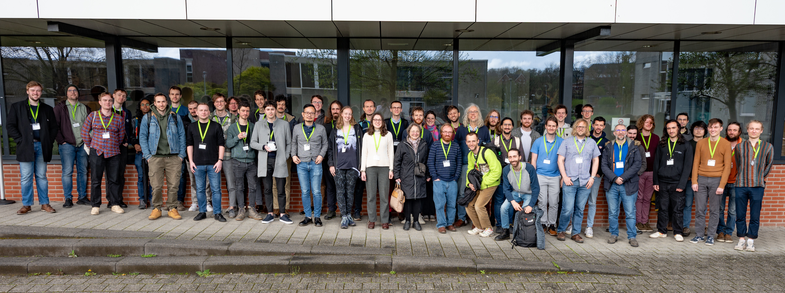

**Date:** 4-5 April 2024, in co-location with the [HoTT/UF 2024 Workshop](https://hott-uf.github.io/2024/).

**Place:** Leuven, Belgium

**Venue:** Dept. of Computer Science  
Celestijnenlaan 200A  
3001 Heverlee (Leuven)  
**Talks:** Auditorium Erik Duval, 200A.00.225  
**Collaborative room:** Seminar room 200A.00.144  
**Livestream:** <https://livestream.kuleuven.be/?pin=829052>  
Note: If it freezes or does not load, reloading can help.

**[Local information](https://anuyts.github.io/2024/venue.html)** - ⚠️⚠️ Please beware of accommodation-related scam emails targetting this specific event. ⚠️⚠️

The aim of this meeting series is to bring together researchers working on the topics of [working group 6 of EuroProofNet](https://europroofnet.github.io/wg6/). The main focus is thus on the syntax and semantics of type theory.
This includes, but is not limited to the goal of WG6:

> The aim of this WG is to develop a comprehensive theory of type theories, which (i) accounts for its domain-specific variants and the type theories currently used in proof assistants, and (ii) allows for the modular reasoning about their syntax and semantics.

The programme will consist mainly of short talks and plenty of time
for discussion. The meeting will be in person and is open to anyone
interested in type theory. Talks can expose published work or work in
progress. Submissions of open questions and topics to be discussed
collectively are also welcome: please use the same form and clearly mark your
entry as a discussion proposal, we will try to organize a few short discussion sessions.

**Schedule and abstracts:** Please see [here](programme)

**Invited speakers**

- [Liang-Ting Chen](https://l-tchen.github.io/) (Institute of Information Science, Academia Sinica, Taiwan): *From Datatype Genericity to Language Genericity* ([Abstract](programme#ltchen) - [Slides](./slides/ltchen.pdf))
- [Meven Lennon-Bertrand](https://www.meven.ac/) (University of Cambrige, UK): *Towards a certified type theoretic kernel* ([Abstract](programme#lennonbertrand) - [Slides](./slides/lennonbertrand.pdf))
- [Dmitrij Szamozvancev](https://www.cl.cam.ac.uk/~ds709/) (University of Cambrige, UK): *Functorial models of scope-safe syntax* ([Abstract](programme#szamozvancev) - [Slides](./slides/szamozvancev.pdf))
- [Maaike Zwart](https://maaikezwart.com/) (IT University of Copenhagen, Denmark): *What monads can and cannot do with a bit of extra time* ([Abstract](programme#zwart) - [Slides](./slides/zwart.pdf))

**Contributed talks**

- Vincent R.B. Blazy, Hugo Herbelin & Pierre Letouzey (Université Paris Cité): *Explicit Cumulativity in CC_ω* ([Abstract](programme#blazy-herbelin-letouzey) - [Slides](./slides/blazy.pdf))
- Joris Ceulemans, Andreas Nuyts, Dominique Devriese (KU Leuven): *Admissibility of Substitution for Multimode Type Theory* ([Abstract](programme#ceulemans-nuyts-devriese) - [Slides](./slides/ceulemans.pdf))
- Joshua Chen, Nicolai Kraus (University of Nottingham): *Constructing inverse diagrams in homotopical type theory* ([Abstract](programme#chen-kraus) - [Slides](./slides/jchen.pdf))
- Thiago Felicissimo (Inria/LMF/Deducteam): *Generic bidirectional typing for dependent type theories* ([Abstract](programme#felicissimo) - [Slides](./slides/felicissimo.pdf))
- Jonas Frey (Carnegie Mellon University): *The shape of contexts* ([Abstract](programme#frey) - [Slides](./slides/frey.pdf))
- Ambroise Lafont, Thomas Lamiaux, Benedikt Ahrens (École Polytechnique, ENS Saclay, Delft University of Technology): *Initial semantics for polymorphic type systems* ([Abstract](programme#lafont-lamiaux-ahrens))
- Roussanka Loukanova (Department of Algebra and Logic, Institute of Mathematics and Informatics, Bulgarian Academy of Sciences): *Relations between let-Terms of Lambda-Calculus and where-Terms of Type-Theory of Recursion* ([Abstract](programme#loukanova) - [Slides](./slides/loukanova.pdf))
- Jacob Neumann (University of Nottingham): *Towards Modal SOGATs* ([Abstract](programme#neumann) - [Blackboard](./slides/neumann.jpg))
- Josselin Poiret (Nantes Université and Inria, Galinette Team): *A multiverse type theory* ([Abstract](programme#poiret))
- Stelios Tsampas (Friedrich-Alexander-Universität Erlangen-Nürnberg): *Logical Relations in Higher-Order Mathematical Operational Semantics* ([Abstract](programme#tsampas) - [Slides](./slides/tsampas.pdf))
- Théo Winterhalter (Inria Saclay): *Dependent ghosts enjoy reflection for free* ([Abstract](programme#winterhalter) - [Slides](./slides/lennonbertrand.pdf))

**Deadlines**

- ~~Submission of talk proposals: 2 February 2024 / 9 February 2024 (AoE)~~
- ~~Author notification: 16 February 2024~~
- ~~Funding requests: 23 February 2024 (AoE)~~
  - ~~Please register also as EuroProofNet member (see below) by this deadline.~~
- Funding notification: 4 March 2024
- Registration: ~~8 March 2024~~ **15 March 2024 (AoE)**
- Meeting itself: 4-5 April 2024

**Funding:**
The reimbursement concerns the official dates of the WG6 meeting: Apr 4-5 (so not the co-located event).
For information regarding reimbursement, please see [here](../reimbursement-rules).
The daily allowance has been fixed to 140 euros.

The action members who will be reimbursed will be selected among the applicants by
taking into account the following criteria in order: planned contributions to the
objectives and deliverables of the action; inclusive target countries; age; gender;
team with low resources; balance over the action life time between people, teams,
countries and working groups.

To apply for funding, fill out the 
[funding and registration form](http://lipn.univ-paris13.fr/limesurvey/index.php/736237?lang=en)
before February 23.
You can still confirm or cancel your registration after a decision on awarding funding has been made.

Please note that, in order to be eligible for reimbursement, **you ALSO need to register as a EuroProofNet member.**
Information on how to apply can be found on the [EuroProofNet home page](https://europroofnet.github.io/),
and the link to register as a EuroProofNet member is <https://e-services.cost.eu/action/CA20111/working-groups/apply>.
Choose any work groups you like, but in particular WG6.

Current membership can be checked [here](https://www.cost.eu/actions/CA20111/#tabs+Name:Working%20Groups%20and%20Membership) (not alphabetical, despite appearances).

**Submission of proposals:**
~~[Submission form](https://lipn.univ-paris13.fr/limesurvey/index.php/752657?lang=en)~~
(Submission is closed.)

**Registration:**
[Registration form](http://lipn.univ-paris13.fr/limesurvey/index.php/736237?lang=en)

**Local information:** Please see [here](https://anuyts.github.io/2024/venue.html).

**Organizers:** [Marie Kerjean](https://lipn.univ-paris13.fr/~kerjean/) and [Andreas Nuyts](https://anuyts.github.io/)

**Local Organizer:** [Andreas Nuyts](https://anuyts.github.io/)
