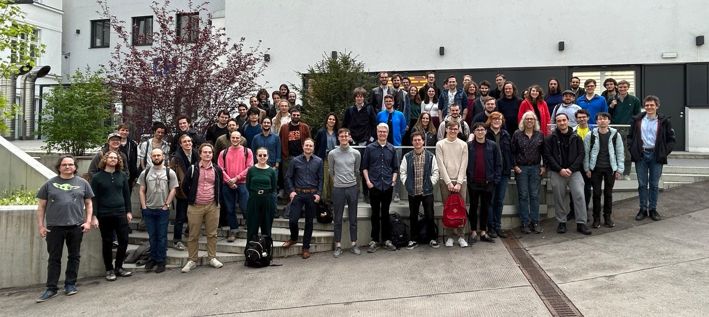

**Date:** 24-25 April 2023

**Place:** Vienna, Austria

**Venue:** Gußhausstraße 27 - 29, 1040 Wien, Austria,
4.OG, Seminarraum CH EG (ground floor), Room number CD 04 04.
Streaming room (when not enough space): Room CF 01 53 (first floor, counting from zero)

[How to get there (map)](venue.png).

Co-located with the [HoTT/UF 2023 Workshop](https://hott-uf.github.io/2023/).

The aim of this meeting series is to bring together researchers working on the topics of [working group 6 of EuroProofNet](https://europroofnet.github.io/wg6/). The main focus is thus on the syntax and semantics of type theory.

The programme will consist mainly of short talks, and plenty of time for discussion. The meeting will be in person and is open to anyone interested in type theory.

**Invited speakers**  
[Daniel Gratzer](https://jozefg.github.io/) (Aarhus University):
_Controlling unfolding in type theory_ ([slides](./slides/gratzer.pdf))  
[Ambroise Lafont](https://amblafont.github.io/) (University of Cambridge):
_Generic pattern unification: a categorical approach_ ([slides](./slides/lafont.pdf))  
[Anders Mörtberg](https://staff.math.su.se/anders.mortberg/) (Stockholm University):
_Computational proofs in Cubical Type Theories_ ([slides](./slides/mortberg.pdf))  
[Loïc Pujet](https://pujet.fr/) (INRIA):
_Mechanising reducibility proofs in Coq_ ([slides](./slides/pujet.pdf))  

**Contributed talks**  
Rafaël Bocquet (Eötvös Loránd University):
_For the Metatheory of Type Theory, Internal Sconing Is Enough_ ([slides](./slides/bocquet.pdf))  
Felix Bradley	(Royal Holloway, University of London):
_On the Metatheory of Subtype Universes_ ([slides](./slides/bradley.pdf))  
Maximilian Doré (University of Oxford):
_Automating reasoning in cubical type theory_ ([slides](./slides/dore.pdf))  
Thiago Felicissimo (Deducteam/LMF/Inria):
_A Logical Framework for Computational Type Theories_ ([slides](./slides/felicissimo.pdf))  
Rasmus Møgelberg (IT University of Copenhagen):
_Higher Inductive Types in Coinductive Definitions via Guarded Recursion_ ([slides](./slides/mogelberg.pdf))  
Vincent Moreau (IRIF, Université Paris Cité):
_Profinite lambda-terms and parametricity_ ([slides](./slides/moreau.pdf))  
Andreas Nuyts (KU Leuven):
_Every modality is a relative right adjoint_ ([slides](./slides/nuyts.pdf))  
Nima Rasekh (Max Planck Institute for Mathematics):
_Category Theory of Universes_ ([slides](./slides/rasekh.pdf))  
Taichi Uemura (Stockholm University):
_Towards modular proof of normalization for type theories_ ([slides](./slides/uemura.pdf))  

**Schedule and abstracts:** Please see [here](programme).

**Participants:** Please see [here](participants)

**Deadlines (AoE)**  
Submission of talk proposals: Monday 27 February
Author notification: Tuesday 7 March
Funding requests: Sunday 19 March
Registration: Friday 7 April

**Registration & funding:**
Registration is now closed. For information regarding reimbursement, please see [here](../reimbursement-rules). The daily allowance has been fixed to 140 euros.

**Local information:** Please see [here](https://hott-uf.github.io/2023/local-info.html).

**Organizers:** [Paige Randall North](https://paigenorth.github.io/) and [Jacopo Emmenegger](https://jacopoemmenegger.wordpress.com/)

**Local Organizer:** [Anja Petković Komel](https://anjapetkovic.com/)
